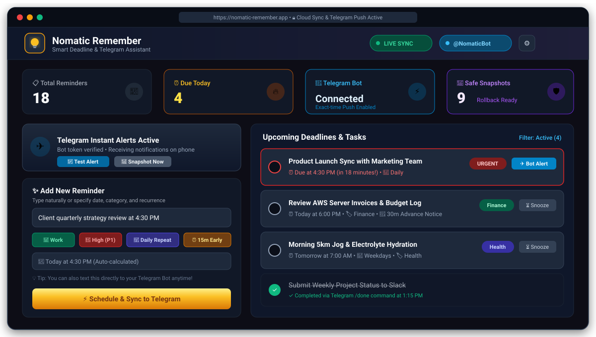

# 💡 Nomatic Remember

> **Smart Cross-Device Daily Task & Recurring Deadline Reminder with Real-Time Telegram Sync, Instant Alerts, Cloud Backups, and Rollback.**

[](https://react.dev/)
[](https://www.typescriptlang.org/)
[](https://vitejs.dev/)
[](https://tailwindcss.com/)
[](https://expressjs.com/)
[](https://core.telegram.org/bots/api)
[](https://web.dev/progressive-web-apps/)

---

## 📸 App Preview & Screenshot



### 🖥️ Dashboard Layout Overview

```text
┌────────────────────────────────────────────────────────────────────────────────────────┐
│ 💡 Nomatic Remember                      [ 🟢 LIVE SYNC ]  [ ✈️ @NomaticBot ]  [ ⚙️ ]   │
├────────────────────────────────────────────────────────────────────────────────────────┤
│  📋 TOTAL REMINDERS   ⏰ DUE TODAY        🤖 TELEGRAM BOT          💾 ROLLBACK POINTS   │
│         18                   4               Connected (Push ON)        9 Snapshots    │
├───────────────────────────────────────────┬────────────────────────────────────────────┤
│  ⚡ TELEGRAM HUB                          │  📋 SCHEDULED DEADLINES & TASKS            │
│  • Status: Connected & Verified           │                                            │
│  • [📲 Send Test Alert] [💾 Snapshot Now] │  🔴 Product Launch Sync (Due in 18 min!)   │
│                                           │     ⏰ 4:30 PM • 💼 Work • 🔁 Daily         │
│  ✨ CREATE NEW REMINDER                   │     [✓ Mark Done] [⏳ Snooze] [✈️ Alert ON]│
│  ┌──────────────────────────────────────┐ │                                            │
│  │ "Review AWS invoices at 6:00 PM"     │ │  🟡 Review AWS Invoices                    │
│  └──────────────────────────────────────┘ │     ⏰ 6:00 PM • 🏷️ Finance • 🔔 30m Notice │
│  [💼 Work] [🔴 High] [🔁 Daily] [⏰ 15m]  │                                            │
│  [⚡ Schedule & Sync to Telegram]         │  🟢 Morning 5km Jog                        │
│                                           │     ⏰ Tomorrow 7:00 AM • 🔁 Weekdays      │
│  🛡️ BACKUP & INSTANT ROLLBACK             │                                            │
│  • Restore any prior state in 1-click     │  ✓  Weekly Project Status Report           │
│  • Automatic safety checkpoints           │     Completed via Telegram /done at 1:15pm │
└───────────────────────────────────────────┴────────────────────────────────────────────┘
```

---

## ✨ Features at a Glance

* **💡 Google Keep-Inspired Aesthetic**: Minimalist, high-focus dark slate UI with golden amber accents, intuitive tag chips, and distraction-free task management.
* **✈️ Real-Time Telegram Sync**: Exact-time push notifications sent directly to your phone via Telegram Bot. Never miss a deadline even with your browser closed!
* **🤖 Natural Language Processing (NLP)**: Type tasks like `"Client call tomorrow at 3pm"` or `"Take medicine every day at 8:00 AM"` and watch time, date, and recurrence auto-populate.
* **🔁 Flexible Recurrence Engine**:
  * 🔄 Daily
  * 💼 Weekdays (Monday–Friday)
  * 📅 Weekly
  * 📆 Bi-weekly
  * 🗓️ Monthly
  * ⚙️ Custom interval (every *N* days)
* **⏰ Advance Notice Alerts**: Receive early heads-up alerts (5m, 15m, 30m, 1 hour before due time) in addition to exact-time alerts.
* **💾 Snapshot Backups & Instant Rollback**:
  * Create manual or automated snapshots of all reminders.
  * Rollback with zero data loss (system automatically takes a safety snapshot before any restore operation).
  * Export and import raw JSON backups anytime.
* **📱 Progressive Web App (PWA)**:
  * Installable on Android, iOS, macOS, Windows, and Linux.
  * Fast launch from home screen and offline cache support.
* **🧪 Telegram Bot Sandbox / Simulator**:
  * Test bot commands (`/start`, `/remind`, `/list`, `/done`, `/snooze`, `/backup`, `/rollback`) directly within the web app UI without touching your phone.
* **📊 Visual Task Metrics**: Instant counts for Total Active, Due Today, Overdue, and Completed tasks.

---

## 🤖 Telegram Bot Commands

When connected to your Telegram Bot, you can manage your entire task schedule right from the chat:

| Command | Description | Example |
| :--- | :--- | :--- |
| `/start` | Welcome greeting, reveals your Chat ID, and shows command guide | `/start` |
| `/id` or `/chatid` | Displays your unique Telegram numeric Chat ID | `/id` |
| `/remind <time> <task>` | Schedules a new reminder with natural language time parsing | `/remind 4:30 PM Team Sync` |
| `<task> at <time>` | Quick natural text reminder creation | `Submit tax docs tomorrow at 11am` |
| `/list` or `/tasks` | Lists upcoming active reminders with their IDs and scheduled times | `/list` |
| `/done <id>` | Marks a reminder as completed by ID or list number | `/done 1` or `/done rem-1710` |
| `/snooze <id>` | Delays a reminder by 10 minutes | `/snooze 1` |
| `/backup` | Creates an instant cloud snapshot of all reminders | `/backup` |
| `/rollback` | Reverts your reminders to the last snapshot | `/rollback` |

---

## ⚙️ How to Configure Telegram Bot

Setting up your Telegram Bot takes less than 2 minutes. Follow these simple steps:

### 1️⃣ Step 1: Create a Bot via `@BotFather`
1. Open Telegram on your phone or desktop.
2. Search for the official [**@BotFather**](https://t.me/botfather) and click **Start**.
3. Send the command:
   ```text
   /newbot
   ```
4. Choose a friendly display name for your bot (e.g. `My Reminder Bot`).
5. Choose a username ending in `bot` (e.g. `my_nomatic_reminder_bot`).
6. BotFather will provide an **HTTP API Token**. It looks like this:
   ```text
   7123456789:AAFlX_x1Kz8bPQmE9eLqR3tW-Vexample
   ```

### 2️⃣ Step 2: Get Your Telegram Chat ID
You need your numerical Telegram User/Chat ID so the bot knows where to send your reminders:
* **Option A (Easiest)**: Send `/start` to your newly created bot in Telegram.
* **Option B**: Message [**@userinfobot**](https://t.me/userinfobot) on Telegram — it instantly replies with your numeric `Id` (e.g. `123456789`).

### 3️⃣ Step 3: Link Your Bot in the App
1. Open the Nomatic Remember web app.
2. On the **Telegram Link** card, click **`+ Add Key`** (or open **Settings ⚙️**).
3. Paste your **Bot Token** into the token field.
4. Paste your **Chat ID** (optional if already sent `/start` to the bot).
5. Click **Verify & Connect Key**.
6. The app will verify your token against Telegram's `getMe` API and display:
   ```text
   Connected (@your_bot_username)
   ```
7. Click **`📲 Send Test Message`** to verify delivery on your phone!

---

## 🚀 How to Run the Project Locally

### 📋 Prerequisites
* **Node.js**: `v18.0.0` or higher
* **npm** (or **bun** / **pnpm** / **yarn**)

### 📥 1. Clone the Repository
```bash
git clone https://github.com/your-username/nomatic-remember.git
cd nomatic-remember
```

### 📦 2. Install Dependencies
```bash
npm install
```

### 🔧 3. Set Up Environment Variables (Optional)
Copy the template `.env.example` to `.env`:
```bash
cp .env.example .env
```
Inside `.env`, you can optionally predefine:
```env
# Port for Express and Vite dev server
PORT=3000

# Optional: Pre-configure Telegram Bot
TELEGRAM_BOT_TOKEN="your_bot_token_here"
TELEGRAM_CHAT_ID="your_numeric_chat_id_here"

# Public URL (Used for Webhooks on hosted deployments)
APP_URL="http://localhost:3000"
```
*(Note: You can also configure the Telegram Token directly in the web UI without modifying `.env`)*

### 💻 4. Run Development Server
```bash
npm run dev
```
Open your browser and navigate to:
```text
http://localhost:3000
```
> The development server runs **Express** with integrated **Vite middleware** and Hot Module Replacement (HMR) for instant code updates.

### 🏗️ 5. Build for Production
```bash
npm run build
```
This compiles the TypeScript code and produces an optimized production bundle in `/dist` along with the PWA Service Worker assets.

### 🚀 6. Start the Production Server
```bash
npm start
```
Runs the Express production server serving static assets from `/dist` and listening on `PORT=3000`.

---

## ⏰ Background Reminder Scheduler & Crons

Nomatic Remember uses a dual-engine architecture to guarantee reliable delivery:

1. **In-Memory Exact-Tick Daemon (Every 10 Seconds)**:
   * `server.ts` runs an internal interval `setInterval(runReminderTick, 10000)` that inspects pending tasks and calculates advance notices.
   * If a deadline is reached, it fires the Telegram alert and updates task state.
   * For recurring tasks, it automatically calculates the next occurrence timestamp and reschedules the deadline.

2. **Cloud Cron Endpoint (`GET /api/cron/tick`)**:
   * For serverless environments like **Vercel** or cloud hosting platforms that spin down containers when idle, `vercel.json` defines a 1-minute recurring cron:
     ```json
     {
       "crons": [
         {
           "path": "/api/cron/tick",
           "schedule": "* * * * *"
         }
       ]
     }
     ```
   * Any external uptime monitor (e.g. UptimeRobot, Cron-Job.org, GitHub Actions) can ping `https://your-app.com/api/cron/tick` every minute to trigger reminder checks.

---

## 🔌 REST API Reference

The backend exposes a full suite of JSON endpoints:

### 📌 Reminders
| Method | Endpoint | Description |
| :--- | :--- | :--- |
| `GET` | `/api/status` | System health, counts (today, active, overdue), and next due task |
| `GET` | `/api/reminders` | Query reminders with `?category=`, `?priority=`, `?completed=`, `?search=` |
| `POST` | `/api/reminders` | Create a new reminder |
| `PUT` | `/api/reminders/:id` | Update title, description, due date, category, recurrence |
| `DELETE` | `/api/reminders/:id` | Delete a reminder |
| `POST` | `/api/reminders/:id/toggle` | Toggle completion status |
| `POST` | `/api/reminders/:id/snooze` | Delay reminder by *N* minutes (body: `{ "minutes": 10 }`) |

### 🤖 Telegram & Backups
| Method | Endpoint | Description |
| :--- | :--- | :--- |
| `GET` | `/api/telegram/config` | Retrieve current bot status and connection info |
| `POST` | `/api/telegram/config` | Save Telegram bot token and chat ID |
| `POST` | `/api/telegram/verify` | Verify token against Telegram `getMe` API |
| `POST` | `/api/telegram/test` | Send a test notification to Telegram |
| `POST` | `/api/telegram/backup` | Create a rollback snapshot & dispatch backup to Telegram |
| `GET` | `/api/telegram/rollbacks` | Retrieve list of all available rollback points |
| `POST` | `/api/telegram/rollback/:id` | Restore database to target snapshot (with auto safety backup) |
| `POST` | `/api/telegram/restore-json` | Restore database from uploaded JSON file |
| `GET` | `/api/telegram/logs` | Fetch real-time delivery and error logs |
| `POST` | `/api/telegram/webhook` | Telegram Bot Webhook endpoint for incoming chat messages |
| `POST` | `/api/telegram/simulate` | Sandbox simulator for testing commands in browser UI |
| `GET` | `/api/cron/tick` | Cron runner endpoint for scheduled checks |

---

## 📂 Project Structure

```text
├── index.html                   # HTML entry point with PWA meta tags & title
├── metadata.json                # AI Studio application metadata
├── package.json                 # Project scripts and dependencies
├── server.ts                    # Express backend, Telegram API & scheduler
├── reminders_store.json         # Persistent JSON file database
├── tsconfig.json                # TypeScript compiler configuration
├── vercel.json                  # Vercel serverless cron config
├── vite.config.ts               # Vite configuration with PWA plugin
│
├── public/                      # Static assets
│   ├── app-screenshot.svg       # UI Dashboard preview graphic
│   ├── icon.svg                 # Google Keep-inspired glowing bulb emblem
│   ├── favicon.ico              # Browser favicon
│   ├── apple-touch-icon.png     # iOS home screen icon
│   ├── pwa-192x192.png          # PWA 192px icon
│   └── pwa-512x512.png          # PWA 512px icon
│
└── src/                         # React Frontend
    ├── main.tsx                 # React entry point with PWA registration
    ├── App.tsx                  # Primary Dashboard UI component
    ├── types.ts                 # Shared TypeScript data models
    └── utils/
        └── telegramHelper.ts    # Natural language parsing & date calculations
```

---

## 🛡️ Security & Best Practices

* **Token Masking**: Bot tokens are securely masked in the frontend (`7123...4aBc`) to prevent screen-share leakage.
* **Safe Rollbacks**: Before restoring any snapshot or JSON import, an automatic `pre_restore` safety point is created.
* **Data Persistence**: Changes are written atomically to `reminders_store.json` so you never lose tasks upon server restarts.
* **No Telemetry**: Completely private and free from tracking scripts or analytics bloat.

---

## 🤝 Contributing

Contributions, bug reports, and feature requests are welcome!
1. Fork the Project
2. Create your Feature Branch (`git checkout -b feature/AmazingFeature`)
3. Commit your Changes (`git commit -m 'Add some AmazingFeature'`)
4. Push to the Branch (`git push origin feature/AmazingFeature`)
5. Open a Pull Request

---

## 📄 License

This project is licensed under the **MIT License** — feel free to use and adapt it for your personal or commercial projects.
